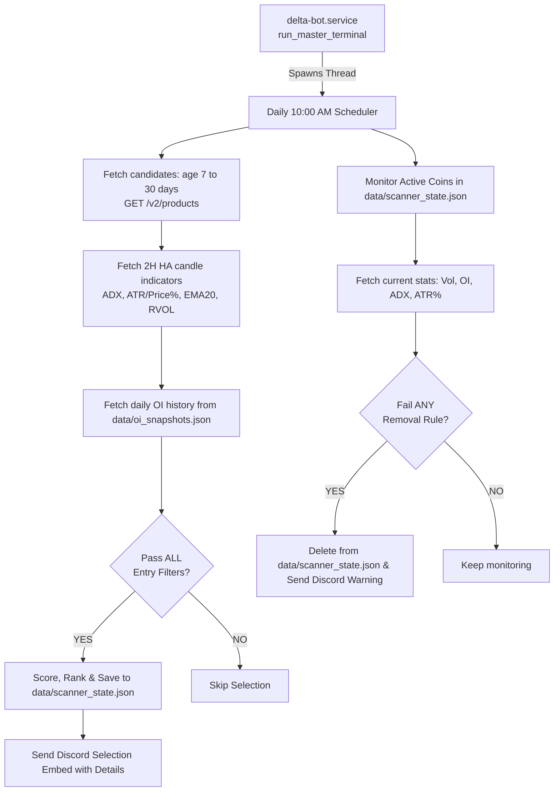

# New Coin Scanner Architecture

This document contains the architecture diagram and data flow of the New Coin Scanner.

## Non-Interference with Live Trading (Safety Principles)

1. **Exception Isolation**: The entire scanning and monitoring logic is enclosed in try-except blocks within a dedicated background thread. Any crash in the scanner cannot crash `delta-bot.service`.
2. **API Rate Limit Integration**: The thread shares the main thread's `DeltaRestClient` instance, utilizing its internal `RateLimiter` sliding window, and inserts a 2-second sleep between requests to avoid starvations.
3. **No Lock Contention**: The thread does not acquire the global `cycle_lock` during API delays, allowing other strategy execution threads to proceed without delay.
